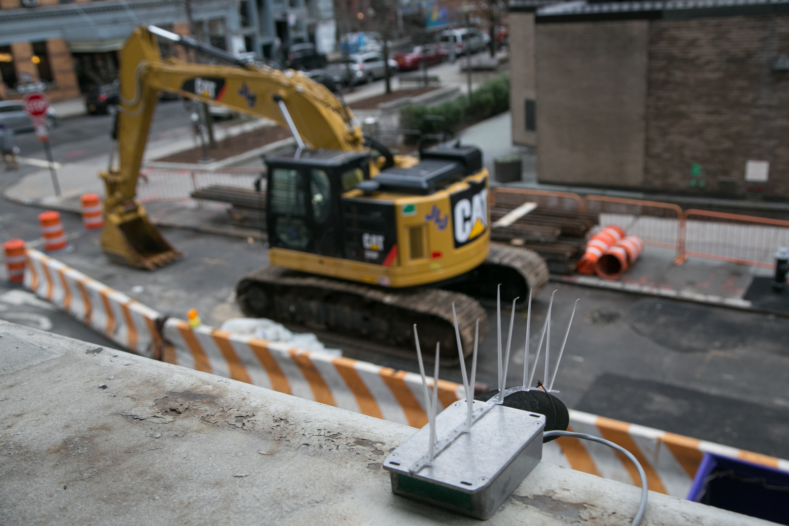
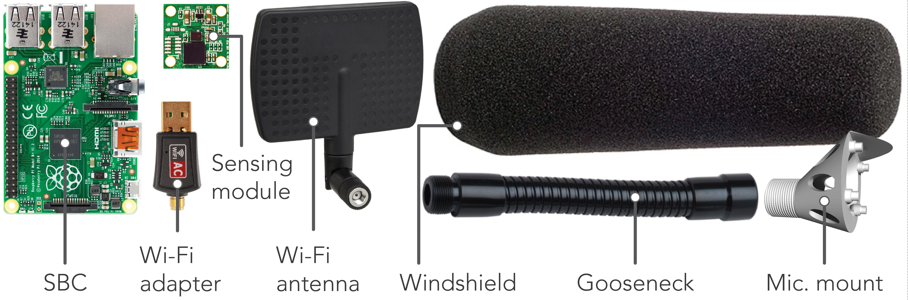

# SONYC Legacy System

## Table of Contents

1. [Parts](https://github.com/kag587/sonyc-legacy-sensor-complete/tree/master/parts)
  
List of all of the parts needed to build a sensor.

2. [Build](https://github.com/kag587/sonyc-legacy-sensor-complete/tree/master/build)
  
Step-by-step building instructions for sensors.

3. [Code](https://github.com/kag587/sonyc-legacy-sensor-complete/tree/master/code)
  
Codebase for SONYC sensors and servers.

4. [Docs](https://github.com/kag587/sonyc-legacy-sensor-complete/tree/master/docs)
  
Additional documents and information about SONYC Legacy sensors.

4. [SD-Setup](https://github.com/kag587/sonyc-legacy-sensor-complete/tree/master/sd-setup)
  
Info about the specific Raspian OS used for this project as well as how to use it.

## Introduction
Noise pollution is an increasing threat to the well-being and public health of city inhabitants. It has been estimated that around 90% of New York City (NYC) residents are exposed to noise levels exceeding the Environmental Protection Agencies (EPA) guidelines on levels considered harmful to people. The complexity of sound propagation in urban settings and the lack of an accurate representation of the distribution of the sources of this noise have led to an insufficient understanding of the urban sound environment. While a number of past studies have focused on specific contexts and effects of urban noise , no comprehensive city-wide study has been undertaken that can provide a validated model for studying urban sound in order to develop long-lasting interventions at the operational or policy level.

In 2017, the NYC 311 information/complaints line received 447,090 complaints about noise, up 6.3% from 2016. NYC has tried to regulate sources of noise since the 1930s and in 1972 it became the first city in the U.S. to enact a noise code. As a result of significant public pressure, a revised noise code went into effect in 2007. This award-winning code, containing 84 enforceable noise violations, is widely-considered to be an example for other cities to follow. However, NYC lacks the resources to effectively and systematically monitor noise pollution, enforce its mitigation and validate the effectiveness of such action. Generally, the Noise Code is complaint driven. The NYC Department of Environmental Protection (DEP) inspectors are dispatched to the location of the complaint to determine the ambient sound level and the amount of sound above the ambient, where a notice of violation is issued whenever needed. Unfortunately, the combination of limited human resources, the transient nature of sound, and the relative low priority of noise complaints causes slow or in-existent responses that result in frustration and disengagement. The extent of the noise problem in NYC, its population, and ever-changing urban soundscape provides an ideal venue for the long term monitoring and ultimately, an enhanced understanding of urban sound.

## Sounds Of New York City Project

At the Sounds Of New York City or SONYC project, we have deployed a network of over 50 low-cost acoustic sensor nodes across NYC to facilitate the continuous, real-time, accurate and source-specific monitoring of urban noise. 

Some of these nodes have been operational since May of 2016, resulting in the accumulation of vast amounts of calibrated sound pressure level (SPL) data and it’s associated metrics. Cumulatively to date, 52 years of SPL and 26 years of raw audio data has been collected from the sensor network. This data can be used to identify longitudinal patterns of noise pollution across urban settings. Using the inferences from this data, decision makers at city agencies can strategically utilize the human resources at their disposal, i.e. by effectively deploying costly noise inspectors to offending locations automatically identified by the network. The continuous and long term monitoring of noise patterns allows for the validation of the effect of this mitigating action in both time and space, information that can be used to understand and maximize the impact of future action. By systematically monitoring interventions, one can understand how often penalties need to be imparted before the effect becomes long-term. With sufficient deployment time, 311 noise complaint patterns can also be compared to the network’s data stream in a bid to model and ultimately predict the occurrence of noise complaints. The overarching goal would be to understand how to minimize the cost of interventions while maximizing noise mitigation. This is a classic resource allocation problem that motivates much research on smart-cities initiatives, including this one.

## Hardware

The acoustic sensor nodes primarily consist of off-the-shelf hardware to
drive down the overall cost of each node.
The figure below shows the components of each sensor.

The popular
Raspberry Pi 2B single-board-computer (SBC) sits at the core of the node
running the Linux Debian based Raspbian operating system, providing all
main data processing, collection and transmission functionality. The
choice of the Raspberry Pi over the plethora of other SBC choices is
mainly due to the maturity and thus stability of the Raspbian operating
system and the large online community that has been developed over the
six years of the Raspberry Pi’s existence. The majority
of nodes make use of a 2.4/5 GHz 802.11 b/g/n USB Wi-Fi adapter for
internet connectivity, however, a number of nodes also employ a low-cost
power-over-ethernet (POE) module which provides internet connectivity
and power over a single ethernet cable. To further enhance Wi-Fi signal strength, we make
use of directional antennas, as shown in the above components diagram. These are more
sensitive on-axis, so can be pointed at the nearest Wi-Fi access point,
increasing signal strength and helping to reduce the negative effects of
unwanted ambient radio frequency (RF) signals.

The flexible gooseneck
covers the microphones USB cabling and allows for the positioning of the
microphone for node mounting on horizontal or vertical surfaces such as
window ledges or walls. The custom microphone mount provides a top hood
for the microphone to reduce the chances of rain water dripping down the
microphone modules front face and into the port. 

Digital microelectromechanical systems (MEMS) microphones were chosen for their low cost, consistency across units and size,
which can be 10x smaller than traditional devices. The model utilized
here has an effective dynamic range of 32–120 dBA ensuring all urban
sound pressure levels can be effectively monitored. It was calibrated
using a precision grade sound-level meter as reference under low-noise,
anechoic conditions, and was empirically shown to produce sound pressure
level (SPL) data at an accuracy compliant with the IEC 61672-1 Type-2
standard  that is required by most US and national noise codes. This
digital microphone contains, within its shielded housing, an
application-specific integrated circuit (ASIC) which performs the analog
to digital conversion of the microphone’s AC signal to a 1-bit pulse
density modulated (PDM) digital signal. This early stage conversion to
the digital domain means there is the absolute minimum of low level
analog signal moving around the circuit, resulting in superior external
radio frequency interference (RFI) and localized electromagnetic
interference (EMI) rejection. EMI from low-cost power supplies and the
SBC are further reduced by the voltage regulator and array of
capacitors, designed to filter out any AC noise on the DC input power
rail. The PDM signal from the MEMS microphone is fed to the
Microcontroller where it is converted to a pulse-code modulated signal
(PCM), filtered to compensate for the microphones frequency response and
fed via USB audio to
the master device, which in this case is our SBC. The enumeration of the
sensing module as a USB audio device means it is SBC agnostic so has the
potential to work with any USB enabled master SBC. The unpopulated JTAG
connector allows the microcontroller to be flashed with updated firmware
if required using an external programmer, however, on module power-up it
will briefly hold in a bootloader mode allowing the firmware to be
updated via USB. This allows for future remote firmware updates
over-the-air, administered by the SBC, via USB to the module’s
microcontroller. 
The PCB has extensive ground planes that
run across each side for effective RFI and localized EMI shielding. The
entire base of the microcontroller is soldered to this plane which acts
as a heat-sink to spread its generated heat across the PCB. A positive
side effect of this is the heating of the closely neighboring MEMS
microphone. Whilst temperature variations are likely to have a minimal
impact on the microphones sensitivity, it aids in maintaining a
relatively constant temperature on the microphone diaphragm, reducing
the effects of water condensation and the possibility of impaired
operation in the event of water freezing anywhere near the microphone
and forcing components out of place.

## More Information

### Other Publications

A list of other publications that feature the SONYC project can be found on the SONYC website [here](https://wp.nyu.edu/sonyc/).

### New York Times

SONYC was featured in a New York Times article about the decreased city noise in April of 2020 due to the COVID-19 pandemic. This article can be found [here](https://www.nytimes.com/interactive/2020/05/22/upshot/coronavirus-quiet-city-noise.html).

