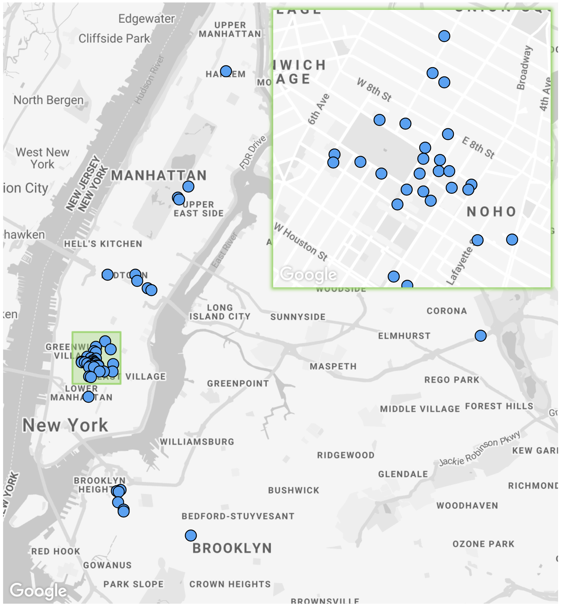
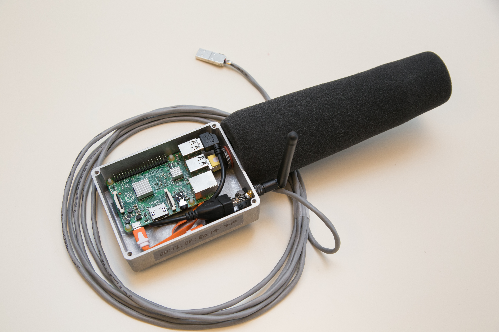
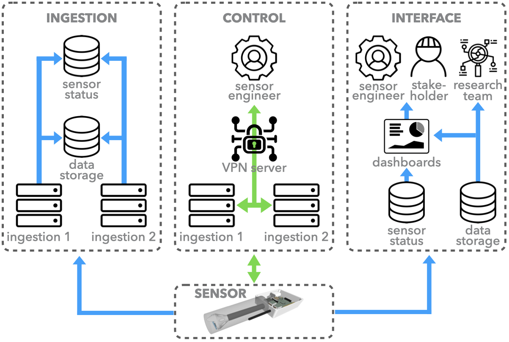
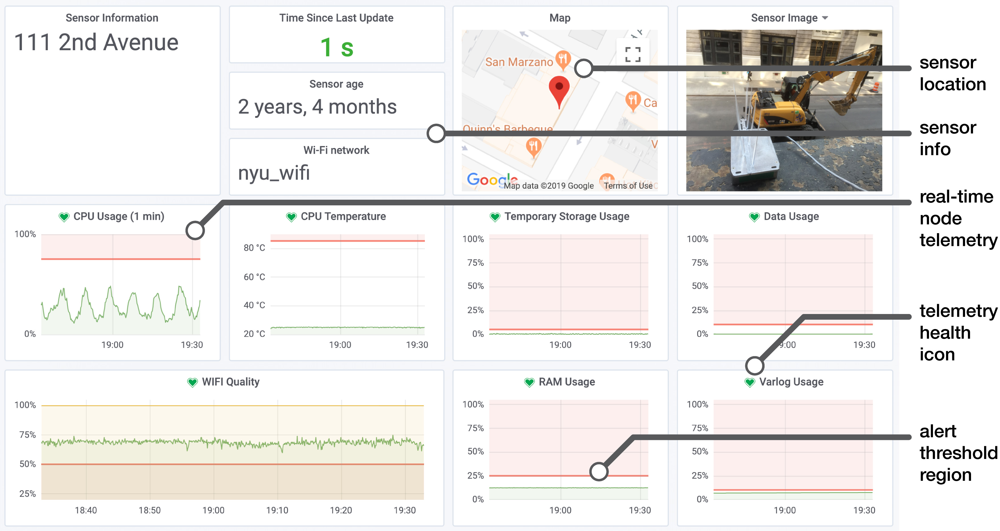

# SONYC legacy system

The Sounds Of New York City or SONYC project was partially funded by a [National Science Foundation (NSF) Cyber Physical Systems (CPS) Frontier grant](https://www.nsf.gov/awardsearch/showAward?AWD_ID=1544753).
 
 
## Content of this repository

1. [Parts:](parts) List of all of the parts needed to build a sensor.

2. [Microphone:](microphone) Details on the project's custom MEMS microphone board including: bill of materials, design files, and firmware.

3. [Build:](build) Step-by-step building instructions for sensors.

4. [Code:](code) Codebase for SONYC sensors and servers.

5. [Docs:](docs) Additional documents and information about SONYC Legacy sensors.

6. [SD-Setup:](sd-setup) Info about the specific Raspian OS used for this project as well as how to use it.

## Introduction
Noise pollution is an increasing threat to the well-being and public health of city inhabitants. It has been estimated that around 90% of New York City (NYC) residents are exposed to noise levels exceeding the Environmental Protection Agencies (EPA) guidelines on levels considered harmful to people. The complexity of sound propagation in urban settings and the lack of an accurate representation of the distribution of the sources of this noise have led to an insufficient understanding of the urban sound environment. While a number of past studies have focused on specific contexts and effects of urban noise , no comprehensive city-wide study has been undertaken that can provide a validated model for studying urban sound in order to develop long-lasting interventions at the operational or policy level.

In 2017, the NYC 311 information/complaints line received 447,090 complaints about noise, up 6.3% from 2016. NYC has tried to regulate sources of noise since the 1930s and in 1972 it became the first city in the U.S. to enact a noise code. As a result of significant public pressure, a revised noise code went into effect in 2007. This award-winning code, containing 84 enforceable noise violations, is widely-considered to be an example for other cities to follow. However, NYC lacks the resources to effectively and systematically monitor noise pollution, enforce its mitigation and validate the effectiveness of such action. Generally, the Noise Code is complaint driven. The NYC Department of Environmental Protection (DEP) inspectors are dispatched to the location of the complaint to determine the ambient sound level and the amount of sound above the ambient, where a notice of violation is issued whenever needed. Unfortunately, the combination of limited human resources, the transient nature of sound, and the relative low priority of noise complaints causes slow or in-existent responses that result in frustration and disengagement. The extent of the noise problem in NYC, its population, and ever-changing urban soundscape provides an ideal venue for the long term monitoring and ultimately, an enhanced understanding of urban sound.

## Sounds Of New York City (SONYC) Project

At the Sounds Of New York City or SONYC project, we have deployed a network of over 55 low-cost acoustic sensor nodes across NYC to facilitate the continuous, real-time, accurate and source-specific monitoring of urban noise. The map below shows the deployed locations of the project's sensor across NYC.

Some of these nodes have been operational since May of 2016, resulting in the accumulation of vast amounts of calibrated sound pressure level (SPL) data and it’s associated metrics. Cumulatively to date, 150 years of SPL and 75 years of raw audio data has been collected from the sensor network. This data can be used to identify longitudinal patterns of noise pollution across urban settings. Using the inferences from this data, decision makers at city agencies can strategically utilize the human resources at their disposal, i.e. by effectively deploying costly noise inspectors to offending locations automatically identified by the network. The continuous and long term monitoring of noise patterns allows for the validation of the effect of this mitigating action in both time and space, information that can be used to understand and maximize the impact of future action. By systematically monitoring interventions, one can understand how often penalties need to be imparted before the effect becomes long-term.

## Hardware

The acoustic sensor nodes primarily consist of off-the-shelf hardware to drive down the overall cost of each node. The figure below shows the components of each sensor.

The popular [Raspberry Pi 2B single-board-computer (SBC)](https://www.raspberrypi.org/products/raspberry-pi-2-model-b/) sits at the core of the node running the Linux Debian based Raspbian operating system, providing all main data processing, collection and transmission functionality. The choice of the Raspberry Pi over the plethora of other SBC choices is mainly due to the maturity and thus stability of the Raspbian operating system and the large online community that has been developed over the many years of the Raspberry Pi’s existence. The majority of nodes make use of a 2.4/5GHz 802.11b/g/n USB Wi-Fi adapter for internet connectivity, however, a number of nodes also employ a low-cost power-over-ethernet (POE) module which provides internet connectivity and power over a single ethernet cable. To further enhance Wi-Fi signal strength, we make use of directional antennas, as shown in the above components diagram. These are more sensitive on-axis, so can be pointed at the nearest Wi-Fi access point, increasing signal strength and helping to reduce the negative effects of unwanted ambient radio frequency (RF) signals.

The flexible gooseneck covers the microphones USB cabling and allows for the positioning of the microphone for node mounting on horizontal or vertical surfaces such as window ledges or walls. The custom microphone mount provides a top hood for the microphone to reduce the chances of rain water dripping down the microphone modules front face and into the port. 

Digital microelectromechanical systems (MEMS) microphones were chosen for their low cost, consistency across units and size, which can be 10x smaller than traditional devices. The model utilized here has an effective dynamic range of 32–120 dBA ensuring all urban sound pressure levels can be effectively monitored. It was calibrated using a precision grade sound-level meter as reference under low-noise, anechoic conditions, and was empirically shown to produce sound pressure level (SPL) data at an accuracy compliant with the [IEC 61672-1 Type-2 standard](https://webstore.iec.ch/publication/5708) that is required by most US and national noise codes. The complete microphone board is shown in the image below.

This digital microphone contains, within its shielded housing, an application-specific integrated circuit (ASIC) which performs the analog to digital conversion of the microphone’s AC signal to a 1-bit pulse density modulated (PDM) digital signal. This early stage conversion to the digital domain means there is the absolute minimum of low level analog signal moving around the circuit, resulting in superior external radio frequency interference (RFI) and localized electromagnetic interference (EMI) rejection. EMI from low-cost power supplies and the SBC are further reduced by the voltage regulator and array of capacitors, designed to filter out any AC noise on the DC input power rail. The PDM signal from the MEMS microphone is fed to the Microcontroller where it is converted to a pulse-code modulated signal (PCM), filtered to compensate for the microphones frequency response and fed via USB audio to the master device, which in this case is the Raspberry Pi 2B. The enumeration of the sensing module as a USB audio device means it is SBC agnostic so has the potential to work with any USB enabled master SBC. The PCB has extensive ground planes that run across each side for effective RFI and localized EMI shielding. The entire base of the microcontroller is soldered to this plane which acts as a heat-sink to spread its generated heat across the PCB. A positive side effect of this is the heating of the closely neighboring MEMS microphone. Whilst temperature variations are likely to have a minimal impact on the microphones sensitivity, it aids in maintaining a relatively constant temperature on the microphone diaphragm, reducing the effects of water condensation and the possibility of impaired operation in the event of water freezing anywhere near the microphone and forcing components out of place.

## Serverside

Our data collection infrastructure consists of a number of physical and virtual servers handling: data ingestion, persistent data storage, secure data access, sensor control, data decryption, and sensor team/stakeholder data visualization via various dashboards. The image below shows the infrastructure overview with core system operations where data flow is in blue and control flow in green.

Two matched, high-power, physical servers make up the ingestion servers that act as the representational state transfer (REST) interfaces for all sensor data upload. Sensors are assigned to one of these independent servers to send data to when they establish a connection for load balancing, scalability, and high availability. Once data is uploaded to the ingestion server, it is cached to a local solid state drive (SSD), before it is securely transferred to the persistent network data storage drive in a data type/sensor/date folder structure. When a day’s data folder is untouched for 24 h, it is compressed into a single tar archive for faster future access. The ingestion servers continue operating, albeit in a reduced state, if other components of the system fail. If the network data storage drive goes offline, the ingestion servers can cache data locally for several weeks.

Each ingestion server runs two OpenVPN based Virtual Private Network (VPN) services. Each VPN connects the ingestion servers to sensor nodes for direct sensor control via a dedicated control server. Each ingestion server has its own VPN address range that is automatically allocated to nodes as they connect. Sensor engineers can SSH directly into sensors when logged into the control server for remote troubleshooting and updating, regardless of which ingestion server the sensor is currently connected to. The sensor’s code-base is maintained in a remote git repository cloned on the device, which can be remotely updated as a batch process, making network updates faster and more reliable than manually pulling changes.

## Sensor network monitoring

Our servers run a distributed [Elasticsearch](https://www.elastic.co/) database which stores and indexes sensor telemetry updates. This database allows our sensing team to obtain a near real-time and, if needed, historic views of the entire sensor network’s operational status. In order to maintain network uptime, it is necessary that we are able to oversee the health of the network. A main dashboard was developed to provide at a glance summary info, which can display the current status of all nodes on a single page. This dashboard displays a table of summary statistics describing the overall health of the network, a map displaying all active sensor node deployment locations, and a sortable, filterable table listing each node and relevant information about the node’s health such as time since last update, Wi-Fi quality, data usage, etc. Each sensor entry has a link to enable editing of a sensor’s meta-data and a link to a more detailed and dedicated dashboard for each sensor shown in the image below. This dedicated dashboard is rendered using [Grafana](https://grafana.com/), an open-source data visualization platform specializing in time-series data. It displays a grid of plots detailing the node’s operation over time, including Wi-Fi strength and quality, CPU usage, CPU temperature, etc.

An important feature of Grafana is the ability to set alerts, which are depicted by the red lines and red shaded regions of the plots in the image above. This provides an interface to setup when alert notifications occur based on custom thresholds and rules, such as: RAM usage exceeding 25% for longer than 10 min. These notifications can be directed to many different platforms including Slack and the messaging app Telegram. The green hearts display the current health status of a particular telemetry parameter.

## More information

### Academic publications

Our [project website contains a list of academic papers](https://wp.nyu.edu/sonyc/publications/) based on work done for the SONYC project.

### Media publications

Our [press page on the project website](https://wp.nyu.edu/sonyc/press/) contains a list of any media stories published about the project.