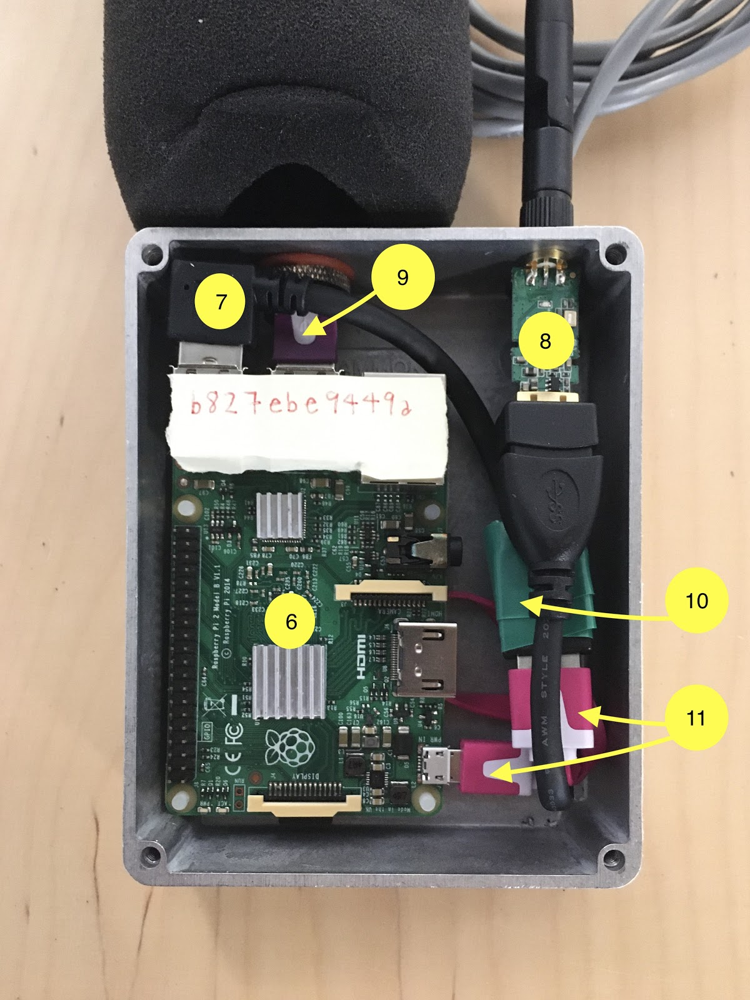
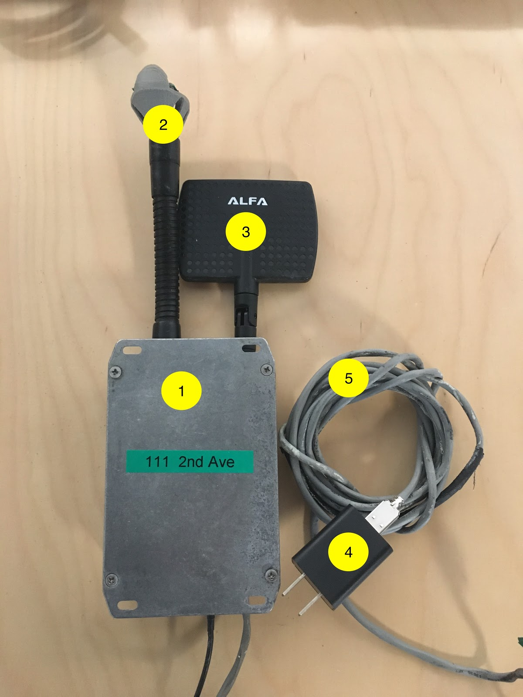

# SONYC Sensor Build Process

*[This](https://github.com/kag587/sonyc-legacy-sensor-complete/blob/master/build/build.md)* file contains the build process for sensors. 

The document includes step by step instrustions, links to needed software, and visual aids.

**Before you read the build procedure!**

The list of required parts for sensors can be found *[here](https://github.com/kag587/sonyc-legacy-sensor-complete/blob/master/parts/parts.md)*

### Sensor Anatomy

This is a look at the inside and outside of a completed sensor. 

*Inside Sensor Anatomy*

  

*Outside Sensor Anatomy*