# Sensor Build Procedure

## Hardware Needed
1. Exacto knife
2. 8" flat micro USB cables

## Procedure
1. At the full size USB end carefully slice the sides from the widest part of the USB plug.
2. Carefully cut down the USB plug as in Figure 1.
3. Carefully cut down the micro USB end as in Figure 1.
4. Ensure no wires are sliced through or visible. 

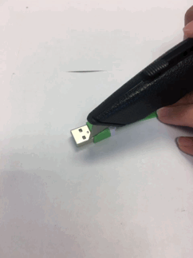
Figure 1: This shows the proper way to cut the USB at both ends which woud then be placed inside the gooseneck.

# Microphone Setup and Preparation

## Hardware Needed
1. SONYC USB microphone (non-programmed)
2. Cypress MiniProg 3 including: JTAG 10 pin cable, SMD male connector attached and mini USB cable
3. Electrical tape
4. Liquid electrical tape
5. Exacto knife
6. Scrap clean A4 paper
7. Windows machine or VM
8. Precut micro USB cable
9. Scissors
10. Microphone gooseneck

## Software Needed
1. [Cypress PSoC Programmer 3.2 or greater](http://www.cypress.com/documentation/software-and-drivers/psoc-programmer-3245 "Cypress Programmer download")
2. [link](INSERT GITHUB LINK TO HEX HERE "Hex file")
3. [Audacity](http://www.audacityteam.org "Audacity") 

## Procedure

1. Ensure work surface is non-conductive, clean and free of any dust and liquids - ensure antistatic precautions.
2. Visual inspection of board. Look for the following:
	* Warping producing cracked traces or raised components.
	* Misaligned components, especially the mic, check through the port on board underside.
	* Missing components - R4 and R6 are intentionally missing
	* Solder bridges.
	* Clear mic port showing gold of the diaphragm.
3. Remove plastic USB cover.
4. Open up PSoC Programmer and plug in MiniProg 3 ensuring PSoC Programmer recognizes it in the `Port Selection` with neighbouring blue box.
5. Set `Device Family` dropdown to `CY8C5xxxLP` and `Device` to `CY8C5667LTI-LP009`
6. Set the path to the hex file in PSoC Programmer by clicking on `File Load`
7. Set `Programming Mode` to `Power Cycle`
8. Set `Connector` to `10p`
9. Set `AutoDetection` to `Off`
10. Set `Clock Speed` to `1.6 MHz`
11. Set `Protocol` to `SWD`
12. Set `Voltage` to `3.3 V`
13. Align MiniProg 3 SMD pins on top of exposed pads on board with the cable side running over the board as seen in Figure 2.
14. Squeeze the pins onto the pads using your thumb and index finger - make sure they are perfectly aligned as seen in Figure 2.
15. Click `Program` in PSoC Programmer when you have the pins squeezed hard and well aligned as seen in Figure 2.

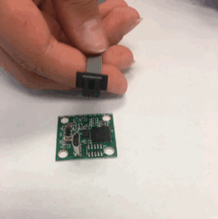 
Figure 2: Perfectly align the pins of the programmer to the pi board and hold it steadily in place until the pir board has finished programming. 

16. You should see the following lines (or something similar) appear in the `Results` pane of PSoC Programmer:
	* `JtagID: 2E 10 90 69`
	* `Erase Succeeded`
	* `Programming of User NVL Succeeded`
	* `Programming of Flash Starting...`
	* `Programming of Flash Succeeded...`
	* `Doing Protect`
	* `Doing Checksum`
	* `Programming Succeeded`
17. If the programming fails, repeat but using a different squeeze technique.
18. Plug the precut micro USB cable into the mic board and then into a computer.
19. Open Audacity and ensure that the mic enumerates as an input device called `SONYC USB Audio`.
20. Make a test recording using a `Project Rate (Hz)` of `48000` and inspect the spectrogram (`Audio Track` dropdown).
	* Right click on the vertical axes to show frequencies upto `21k`.
	* There should not be any continuous horizontal lines above `10k` as this suggests a mic fault.
	* If on playback using headphones you can hear any high pitched noises that do not exist in the room there is a mic fault.
21. Apply a small piece of electrical tape over each of the mount holes on the board with the board on the scrap paper.
22. Reinsert plastic USB cover.
23. Apply liberal covering of liquid electrical tape making sure all areas are well covered and none gets into the USB socket as seen in Figure 3.
24. Set aside to dry for at least 2 hours.
25. Cut around the board where the liquid electrical tape has spread over the edges onto the paper (do not attempt to cut on the PCB).
26. Remove tape ensuring that not too much of the dried liquid electrical tape pulls off the board.
27. Remove any excess liquid electrical tape from the mic port side of the board using fingers.
28. Retest the mic board from stages 18-20 using the same precut USB cable.
29. Remove precut USB cable from mic board and make sure that it can be fed through the gooseneck.
	* If it can't, carefully trim off any excess plastic from the micro USB end.
30. Cover the micro USB end with liquid electrical tape upto the start of the plug itself as in the image and leave to dry for at least 2 hours as seen in Figure 3

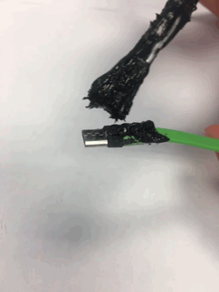
Figure 3: Paint the USB with liquid electrical tape in order to ensure that its water proof.

# Microphone Build

## Hardware Needed
1. Prepared SONYC USB microphone
2. Microphone gooseneck
3. Exacto knife
4. Windows machine or VM
5. Precut micro USB cable
6. Scissors
7. Plastic chopstick
8. 3D printed microphone mount
9. Clamp
10. Red rubber O rings
11. 18" long, 1/2" thick ribbon
12. Windshield

## Software Needed
[Audacity](http://www.audacityteam.org "Audacity") 

## Procedure
1. Cut off and clean mic mount base and run scissor blades around the interior of the mount to clean off any loose print lines
2. Thread mic mount into gooseneck.
	* Can be tricky as you are effectively recutting the mount thread.
	* Make sure the mount and gooseneck thread are aligned well before attempting to thread as seen in Figure 4.
	
	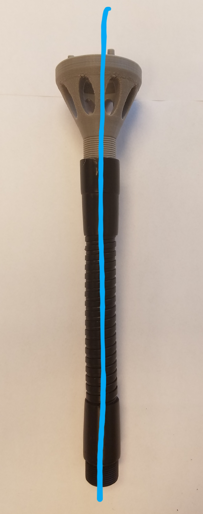
	Figure 4: Align the mount and gooseneck so that its is symmetrical. 
	
	* Once it is in a few turns and feels solid place the scissors through the vents and use that to screw it down so <3 turns of the mic mount thread are showing as seen in Figure 5.
	
	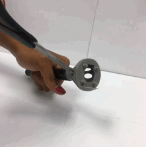
	Figure 5: Secure the mount to gooseneck with scissors.
	
	* If it becomes too difficult to turn you may need to start this stage again.
	* Clamp the gooseneck close to the mic mount to help in screwing the mount.
3. Feed the USB cable through gooseneck so the micro USB end protrudes from the mic mount as seen in Figure 6.

	<image src="images/usbneck.GIF">
	Figure 6: Run the USB through gooseneck.  

4. Plug in the USB mic and carefully mount on the mic mount headers making sure it sits flush as seen in Figure 7.

<image src="images/microchip.GIF">
Figure 7: Connect the USB mic to mount, properly.

5. Apply liquid elecrtrical tape to the head of each of the mount pegs as seen in Figure 8. [Be careful to not put liquid electrical tape into the mic port.]

<image src="images/gluechip.GIF">
Figure 8: Apply liquid electrical tape to back of the mic and to the pegs of the mic in order to esure that the mic chip will be stable and would not interfear with the sound recording. 

6. Apply 1 red rubber O ring to gooseneck thread.
7. Vacuum out the interior of the windshield using a thin nozzle vacuum (instead of vacuuming, you may tap the windshield on a flat surface until you no longer see any loose particles as seen in Figure 9.)
8. Point mic end downwards and work the windshield over the mic mount and gooseneck until the end of the windshield is level with the red O ring as seen in Figure 9.

<image src="images/windshield.GIF">
Figure 9: tapping windshield on flat surface and inserting the gooseneck into the windshield.

10. With the mic end pointing down still, pull the ribbon out from one end.
11. Plug USB into computer and retest for clean audio signal as in `Microphone setup and preparation` stages 18-20.

# Housing Preparation

## Hardware Needed
1. Drill press and chuck
2. Step drill bits
3. Large clamp
4. Sharpie
5. Drill jig

## Procedure
1. Apply rubber seal to housing lid.
	* Position on first pass then use pen to ensure each side and corner is firmly stuck down and flush with the lid lip.
2. Mount drill jig onto one end of the main housing and mark through holes using Sharpie as seen in Figure 10.

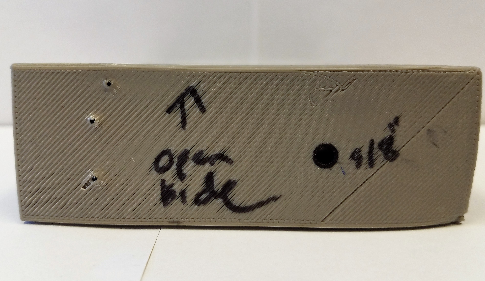
Figure 10: Shows how to properly place the jig.

3. Clamp housing and set depth of drill drop for each hole size.
4. Drill out large gooseneck hole using 5/8" step and smaller wifi antenna and power holes using 9/32" (location of small holes dependent on deployment orientation).
5. Thoroughly clean drill holes and blow out housing of any metal shavings (make sure you are wearing goggles for flying metal).
6. Check that gooseneck thread and antenna fit through holes.

## Procedure for Ethernet Based Housing
1. Apply rubber seal to housing lid.
	* Position on first pass then use pen to ensure each side and corner is firmly stuck down and flush with the lid lip.
2. Mark holes with the seal using a small mechanical pencil. The hole for the ethernet cable is the one closest to the top edge.
3. Clamp housing and set depth of drill drop for each hole size.
4. Drill out large gooseneck hole using 5/8" step and smaller wifi antenna hole using 9/32" (location of small holes dependent on deployment orientation). Drill the ethernet power hole with a 5/16" step and make sure to hold the box down tightly when doing this as seen in Figure 11.

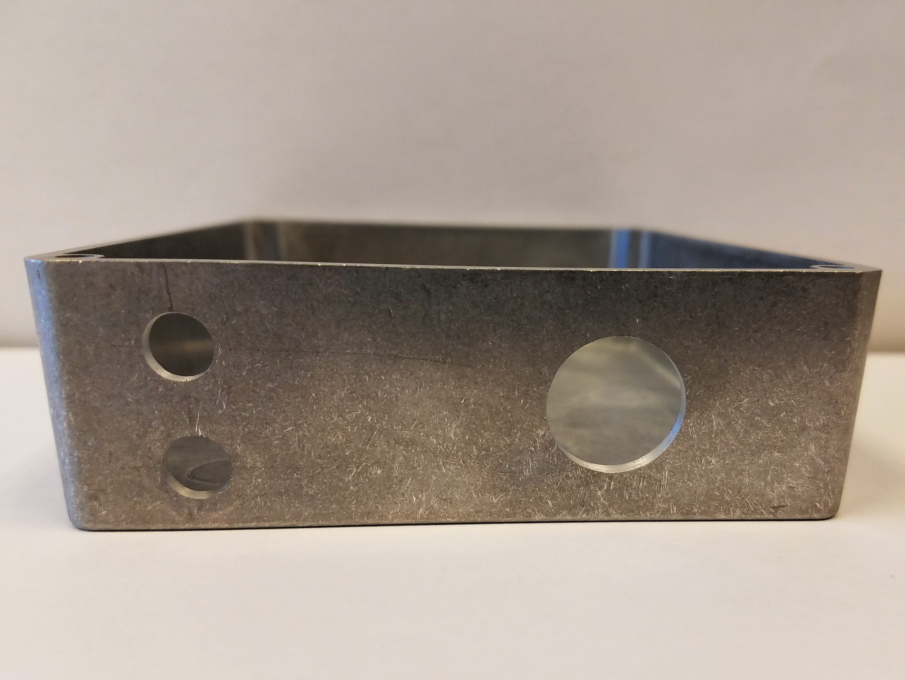
Figure 11: Orientation of housing.

5. Thoroughly clean drill holes and blow out housing of any metal shavings (make sure you are wearing goggles for flying metal).
6. Check that gooseneck thread and antenna fit through holes.

# Mic to Housing Fitting

## Hardware Needed
1. Mic construction
2. Rubber O ring
3. Mic mount lock nut

## Procedure
1. Make sure the red rubber O ring is fit on as seen in Figure 12.
2. Feel the mic for the mic mount base. Carefully touch around the base to find the protective hood of the base. Once found, orient the mic so that the hood is above the mic.
3. With the previous orientation insert the open end of the microphone into the metal box housing.
4. Apply the thin circular lock nut unto the opening and tighten it as seen in Figure 12. 

<image src="images/locknuthousing.jpg" width="300"> 
Figure 12: orientation of USB, lock nut, and red O ring in housing.

# Cable Preparation

## Hardware Needed
1. Wiring
2. Wire cutters
3. Wire strippers
4. Exacto knife
5. Soldering iron
6. Solder
7. Male and female USB connector parts
8. Multimeter
9. Electrical tape
10. Superglue

## Procedure

1. Cut desired cable length as seen in Figure 13 (usually 12ft) - maximum length is 25ft due to voltage drop.
2. Carefully trim off exterior of cable about 1" at each end as seen in Figure 13.
3. Cut off protruding bare sink line and fibres.
4. Make sure you haven't cut the ground or power cables.
5. Strip off 5mm of each ground and power wire at both ends as seen in Figure 13.

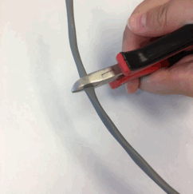
Figure 13: Cutting and stripping cable.

6. Snip off ends so 5mm is exposed.
7. Tin each exposed 5mm wire until saturated but not bloated with solder.
8. Tin pins 1 and 4 of the male USB plug with a small amount of solder.
9. Solder power to pin 1 of plug and ground to pin 4 - make sure it is fully soldered and flat against the pins.
10. Construct USB male plug 
	* Fit black pin protector until it snaps into place as seen in Figure 14.
	* Slide wired socket into metal plug housing with black cover facing down as seen in Figure 14 - white end must be flush and flat with metal plug end.
	* Push cabling sheath/outer layer down until it covers the 2 inner cables past the metal cable cable clamp of the housing.
	* Use continuity test on multimeter to check that there are no shorts between ground, power and metal USB housing.
	* Plug into powered USB socket and test that +5V is seen at bare wire ends.
	* Crimp cable clamp over wire sheath/outer.
	* Apply metal housing cover until it clicks into place.
	
	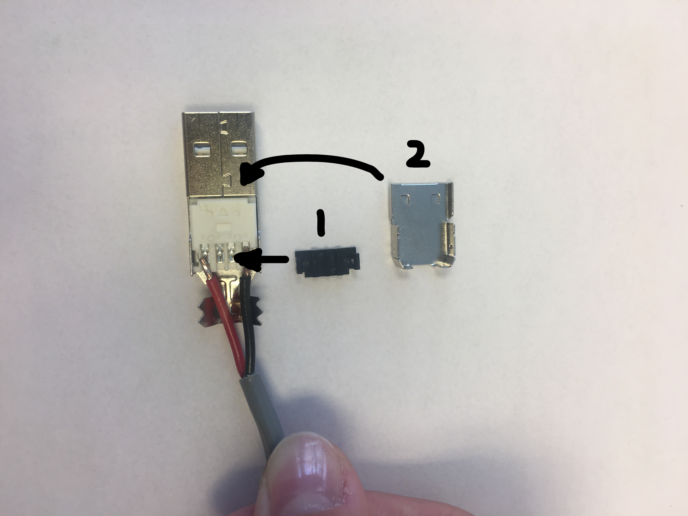
	Figure 14: Pieces and set up for male USB (black side facing down into metal USB housing).
	
11. Apply rubber grommet to lower 9/32" housing hole as seen in Figure 15.

Figure 15: Where the grommet must be placed.

12. Feed in bare cable end slowly until roughly 2' is through.
13. Tin female USB socket making sure the concave side of the pins is facing up as seen in Figure 16.

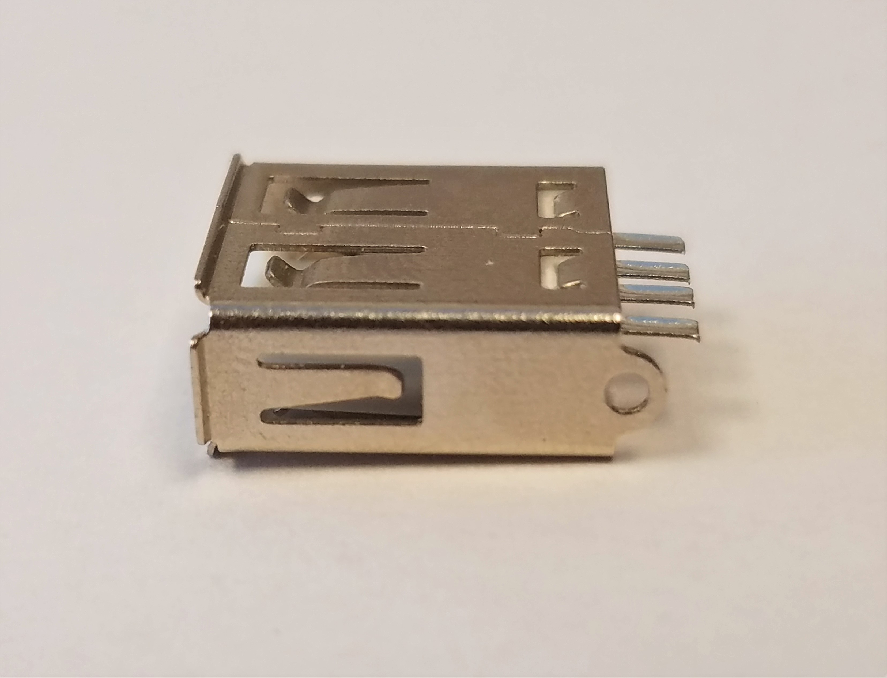
Figure 16: Close up image of the female USB part.

14. Solder power to far left pin and ground to far right as seen in Figure 17 - apply extra solder as needed to make a solid.

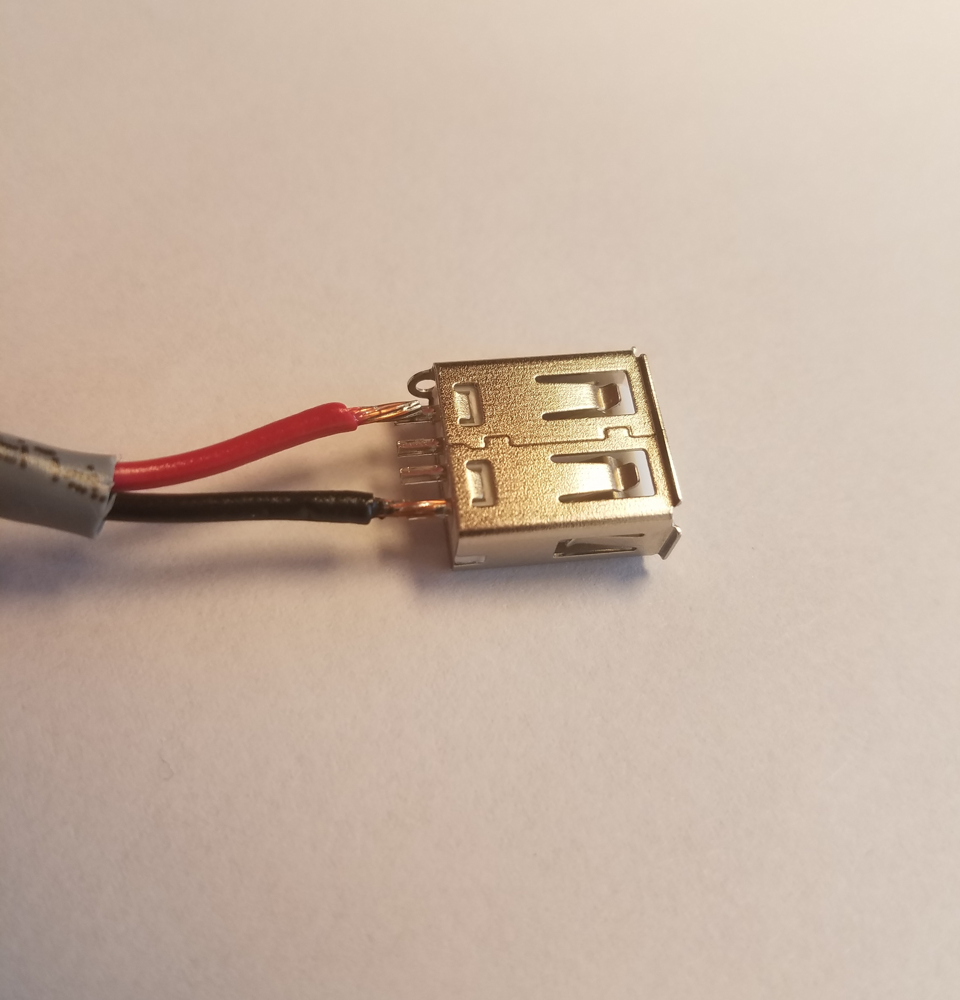
Figure 17: Orientation of female USB and cables when soldered.

15. Ensure soldered power and ground pins do not touch the socket housing or other pins.
16. Push middle 2 pins down and away from the power and ground pins.
17. Push together the power and ground cables so they fit within the non-USB logo'ed plastic USB socket housing.
18. Slide socket into non-USB logo'ed plastic housing and fit wires between guides.
19. Attach USB logo'ed top and tape closed.
20. Test complete USB cable by plugging in a cheap device with a power indication light.
21. Tie single knot in cable as close to the USB female socket as possible as seen in Figure 18 - be careful not to mash the socket around too much.

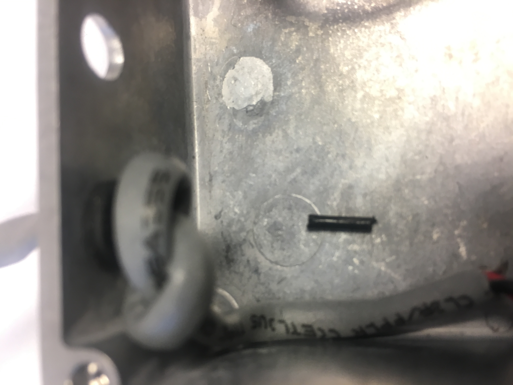
Figure 18: The single knot in the cable inside the housing.

22. Feed cable back out of the metal housing until the knots stops this.
23. Superglue the female USB socket housing to the floor of the metal housing flush against the wall as seen in Figure 19.

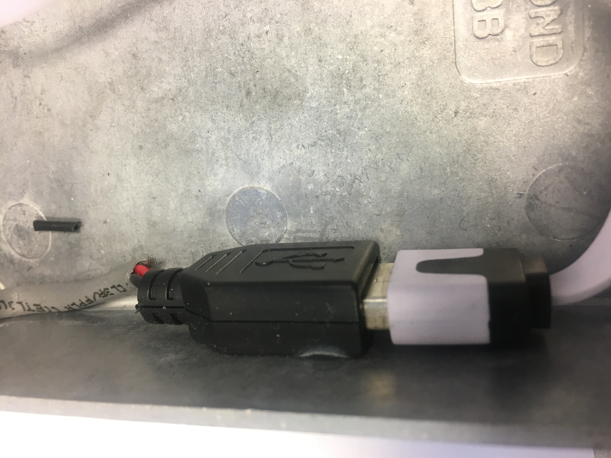
Figure 19: Superglue the female USB inside the housing.

# Finished Product

<image src="images/wholesensor.jpg" width="300">
Figure 20: Image of a complete sensor.
