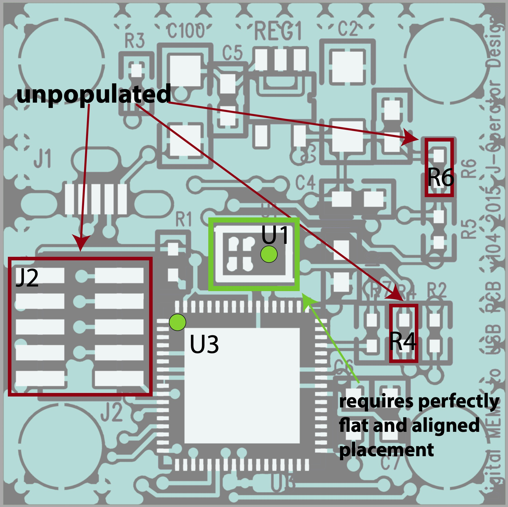
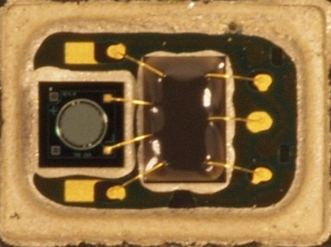
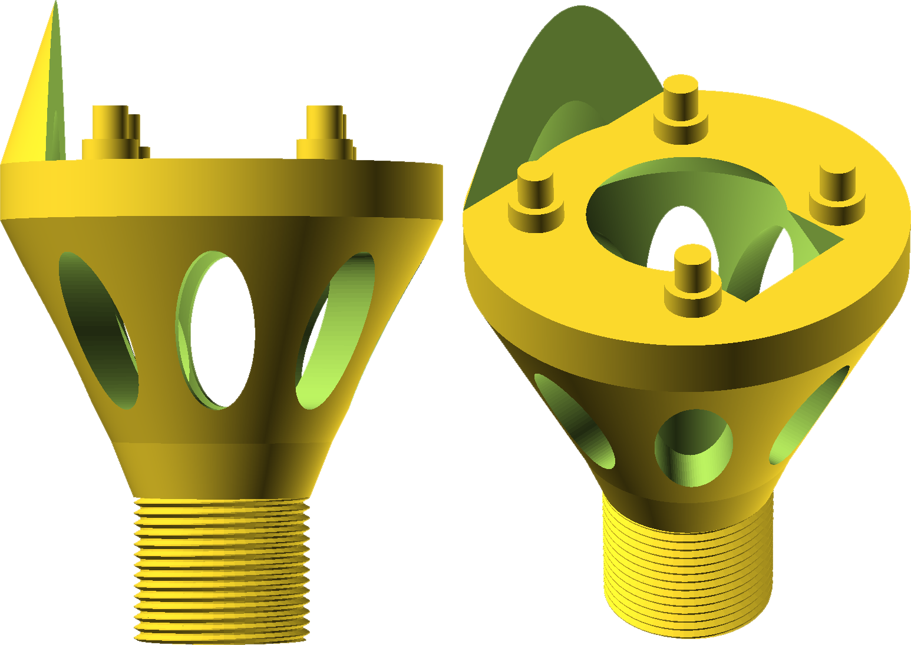
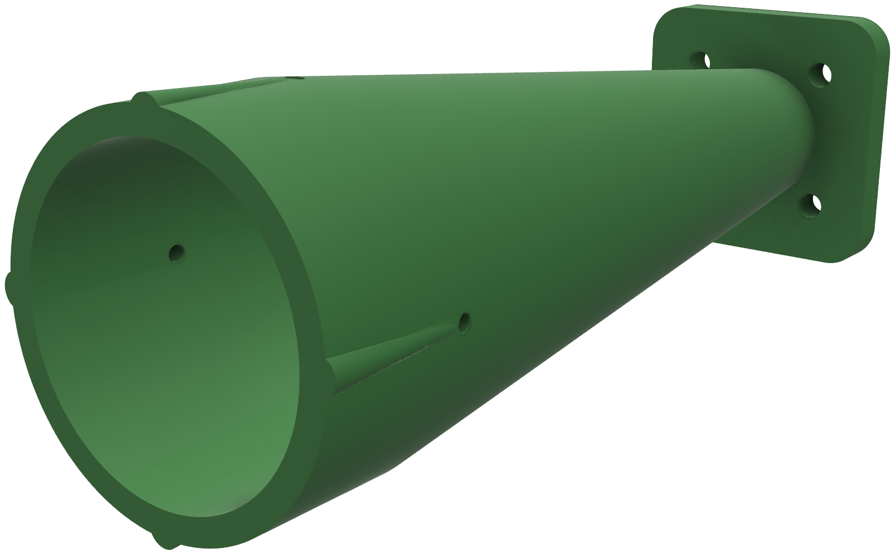

# SONYC custom microphone board

## Hardware

The microphone board was designed with help from Christopher Deckard of J-Operator Designs who I was lucky enough to meet at the AES (I think) conference in 2014. We went through a number of designs using different PDM to USB audio ICs and finally settled on the Cypress PSoC 5LP which may have been overkill but satisfied our design criteria of being able to convert raw PDM audio to PCM for USB audio enumeration and provides the ability to filter audio inline. At this time PDM mics had far better characteristics for our application than analog or I2S examples which added some complexity to the overall design. The mic we used is not recommended for new designs as you can get better specs these days.

The PCB fabrication, component sourcing/assembly, and MCU flashing was handled by [MOKO Technology](https://www.mokotechnology.com/), who we were very happy with after we had ironed out some minor PCB and assembly issues via email. The MCU flashing service was also incredibly helpful as each microphone board arrived ready to use. The quotes from them can be seen [here](microphone-board/fabrication).

The PCB thickness was chosen to be very low at 0.4mm to reduce any mechanical directionality applied to the microphone by the small port through the PCB. The schematic of the board can be found [here](microphone-board/digital MEMs USB v105.pdf).

| Item                                                                                                                                                                                  | Manufacturer | Seller  | Part number        | Count |
|---------------------------------------------------------------------------------------------------------------------------------------------------------------------------------------|--------------|---------|--------------------|-------|
| [Digital MEMs Mic](https://www.digikey.com/en/products/detail/stmicroelectronics/MP34DB01/2764711)                                                                                    | ST           | Digikey | MP34DB01           | 1     |
| [Cypress PSoC 5 (QFN68)](https://www.digikey.com/en/products/detail/cypress-semiconductor-corp/CY8C5667LTI-LP009/13448574)                                                            | Cypress      | Digikey | CY8C56LP           | 1     |
| [Connector (micro USB SMD, vertical)](https://www.digikey.com/en/products/detail/molex/1051330011/4356675?s=N4IgTCBcDaIKwGYAcBaAjABjmhCUYzTRAF0BfIA)                                  | Molex        | Digikey | 1051330011         | 1     |
| [Regulator (SOT23-5)](https://www.digikey.com/en/products/detail/texas-instruments/LP5907MFX-3-3-NOPB/3906441?s=N4IgTCBcDaIDIAUCsBOADAdgLIDEAaAtAMwB0RA9AHIDyCAQiALoC%2BQA)           | TI           | Digikey | LP5907             | 1     |
| [Capacitor (1uF, X5R, 25v, SMD 0603)](https://www.digikey.com/en/products/detail/murata-electronics/GRM188R61E105KA12D/965911?s=N4IgTCBcDaIOICUCyBGAHGhA2FBRFADAKwDSAgimACIgC6AvkA)   | Murata       | Digikey | GRM188R61E105KA12D | 2     |
| [Capacitor (0.1uF, X7R, 25v, SMD 0603)](https://www.digikey.com/en/products/detail/murata-electronics/GRM188R71E104KA01D/587154?s=N4IgTCBcDaIOICUCyBGAHGhB2FBRFADACwDSAggSgCIgC6AvkA) | Murata       | Digikey | GRM188R71E104KA01D | 4     |
| [Capacitor (10uF, X5R, 25v, SMD 1206)](https://www.digikey.com/en/products/detail/kemet/C1206C106K3PACTU/2215114?s=N4IgTCBcDaIMIEYwAYBsi0GkDMAFAgnACoCqIAugL5A)                       | Kemet        | Digikey | C1206C106K3PACTU   | 2     |
| [Resistor (0 ohm, SMD 0402)](https://www.digikey.com/en/products/detail/vishay-dale/CRCW04020000Z0ED/1177495)                                                                         | Vishay       | Digikey | CRCW04020000Z0ED   | 1     |
| [Resistor (10k ohm, SMD 0402)](https://www.digikey.com/en/products/detail/vishay-dale/CRCW040210K0FKED/1178121)                                                                       | Vishay       | Digikey | CRCW040210K0FKED   | 3     |
| [Resistor (22 ohm, SMD 0402)](https://www.digikey.com/en/products/detail/vishay-dale/CRCW040222R0FKED/1177815)                                                                        | Vishay       | Digikey | CRCW040222R0FKED   | 3     |

Digital microelectromechanical systems (MEMS) microphones were chosen for their low cost, consistency across units and size, which can be 10x smaller than traditional devices. The model utilized here has an effective dynamic range of 32–120 dBA ensuring all urban sound pressure levels can be effectively monitored. It was calibrated using a precision grade sound-level meter as reference under low-noise, anechoic conditions, and was empirically shown to produce sound pressure level (SPL) data at an accuracy compliant with the [IEC 61672-1 Type-2 standard](https://webstore.iec.ch/publication/5708) that is required by most US and national noise codes. The complete microphone board including placement info is shown in the image below.

This digital microphone contains, within its shielded housing, an application-specific integrated circuit (ASIC) which performs the analog to digital conversion of the microphone’s AC signal to a 1-bit pulse density modulated (PDM) digital signal. This early stage conversion to the digital domain means there is the absolute minimum of low level analog signal moving around the circuit, resulting in superior external radio frequency interference (RFI) and localized electromagnetic interference (EMI) rejection. The image below shows their internal structure with the diaphragm on the left and ASIC on the right.

EMI from low-cost power supplies and the SBC are further reduced by the voltage regulator and array of capacitors, designed to filter out any AC noise on the DC input power rail. The PDM signal from the MEMS microphone is fed to the Microcontroller where it is converted to a pulse-code modulated signal (PCM), filtered to compensate for the microphones frequency response and fed via USB audio to the master device, which in this case is the Raspberry Pi 2B. The enumeration of the sensing module as a USB audio device means it is SBC agnostic so has the potential to work with any USB enabled master SBC. The PCB has extensive ground planes that run across each side for effective RFI and localized EMI shielding. The entire base of the microcontroller is soldered to this plane which acts as a heat-sink to spread its generated heat across the PCB. A positive side effect of this is the heating of the closely neighboring MEMS microphone. Whilst temperature variations are likely to have a minimal impact on the microphones sensitivity, it aids in maintaining a relatively constant temperature on the microphone diaphragm, reducing the effects of water condensation and the possibility of impaired operation in the event of water freezing anywhere near the microphone and forcing components out of place.

## Cypress PSoC 5LP firmware

USB audio and PDM microphone interface with PSoC 5LP on the Cypress Pioneer kit. The original source and information on this project [can be found here](https://www.element14.com/community/thread/28830/l/psoc-4-pioneer-kit-community-project102-usb-audio-using-the-psoc-5lp).

The SONYC implementation uses a modified pipeline with an included IIR biquad filter stage to compensate for the PDM microphone's frequency response. Input audio bytes stored within 32bits were bit shifted to increase the effective input gain of the system and reduce the influence of the 16bit noise floor on low level audio situations.

The firmware hex file can be found [here](psoc5LP_firmware/PioneerKit_P5LP_USB_Audio/PioneerKit_P5LP_USB_Audio.cydsn/ARM_GCC_441/Debug/PioneerKit_P5LP_USB_Audio.hex) and the elf file [here](psoc5LP_firmware/PioneerKit_P5LP_USB_Audio/PioneerKit_P5LP_USB_Audio.cydsn/ARM_GCC_441/Debug/PioneerKit_P5LP_USB_Audio.elf).

## Microphone mount

In order to securely mount the MEMS microphone board a custom ABS plastic mount was fabricated. This 3D printed component is shown in the image below and ensures the microphone port is unobstructed, protected from water droplets due to the protruding lip and allows for a windshield to be placed around the mount to reduce the effects of wind noise on the microphone. Different versions of this model were designed using the free [OpenSCAD software](https://openscad.org/), and can be [found here](microphone-mount).

The open space behind the microphone board mount point ensures no Helmholtz resonances can build up as a result of a closed cavity close to the microphone. Complex diffraction effects from off-axis sound sources may have an effect on the response at frequencies of >8.5kHz, which corresponds to the 40mm diameter of the custom microphone mount. The dimensions and shape of the MEMS microphone PCB also have the potential to effect response at the >13.5kHz range. The top pegs allow the microphone board to be securely seated, reducing the chance of any mechanical rattling. Externalizing the microphone board in this way also reduces the effects of RFI from the Raspberry Pi.

## Microphone calibration

An acoustic calibrator was designed using the free [OpenSCAD software](https://openscad.org/), and can be [found here](microphone-cal). The 3D printed mount allowed a [compression driver](microphone-cal/D250-X_SpecSheet.pdf) to be screwed into its wider end with a SONYC microphone bolted to the other end. Full range, high fidelity sine sweeps can be played through the compression driver and picked up by the MEMS mic under test with minimal external noise influence. You can see its design in the image below.

The calibrator pipe is tuned to maximize acoustic SPL at the MEMS microphone for 1kHz sine waves. It has pressure relief holes around one end to reduce the chance of the compression driver damaging the MEMS microphone by driving it too hard in the case the seal of the calibrator is air tight.

The calibrator also has a 1/4" adaptor that allows a calibrated sound level meter to be mounted to set the compression drivers output to 1kHz at 94dB. You can then replace the sound level meter with your MEMS microphone which ensures the distance from compression matches that of the sound level meter. This provides a known calibration signal for arbitrary shaped microphones.