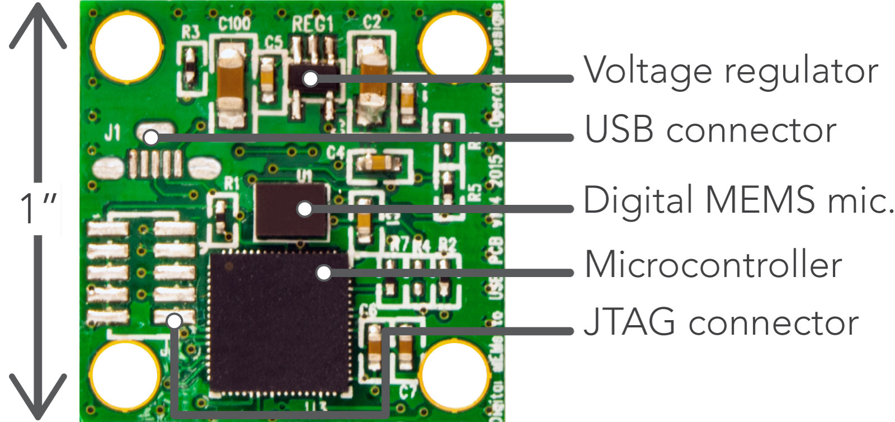

# SONYC custom microphone board Cypress PSoC 5LP firmware

USB audio and PDM microphone interface with PSoC 5LP on the Cypress Pioneer kit. The original source and information [can be found here](https://www.element14.com/community/thread/28830/l/psoc-4-pioneer-kit-community-project102-usb-audio-using-the-psoc-5lp).

The SONYC implementation uses a modified pipeline with an included IIR biquad filter stage to compensate for the PDM microphone's frequency response. Input audio bytes stored within 32bits were bit shifted to increase the effective input gain of the system and reduce the influence of the 16bit noise floor on low level audio situations.

The firmware hex file can be found [here](psoc5LP_firmware/PioneerKit_P5LP_USB_Audio/PioneerKit_P5LP_USB_Audio.cydsn/ARM_GCC_441/Debug/PioneerKit_P5LP_USB_Audio.hex) and the elf file [here](psoc5LP_firmware/PioneerKit_P5LP_USB_Audio/PioneerKit_P5LP_USB_Audio.cydsn/ARM_GCC_441/Debug/PioneerKit_P5LP_USB_Audio.elf).

